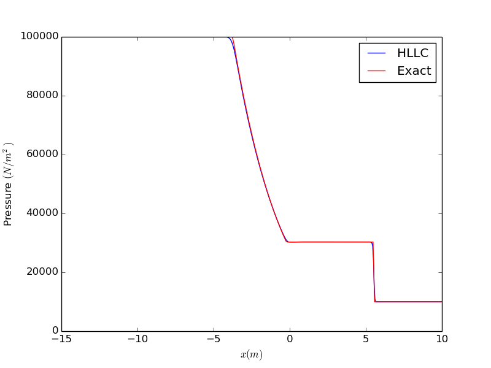

# One-dimensional HLLC Riemann solver 

This is a one-dimensional Riemann solver based on the Harten-Lax-Van Leer-Contact (HLLC) scheme 
with a minmod limiter for limiting the slopes of the primitive variables. 

# Structure of the code
The source code is in `Source`, and the test cases are in `Exec`. In each of the test cases in 
`Exec` - for eg. `Exec/Sod`, there is a file `Initialize.cpp` in which the input parameters, and 
initial condition for the simulation can be specified. There is a Makefile in each of the test case 
directories.

# Compilation and running 
`cd Exec/Sod`   
`sh run_RiemannSolver.sh`

# Visualization
There is a `Results` directory in each test case directory. It contains a Python script 
`PlotSolution.py`. `python PlotSolution.py` will display a movie of the density as a 
function of time.

# Results for the test cases
## Sod shock tube test case

The domain is `-10 < x < 10`. The initial condition is 
`(\rho, u, p) = (1.0, 0.0, 100000.0)` for `x<=0`   
`(\rho, u, p) = (0.125, 0.0, 10000.0)` for `x>0` 

  
  

