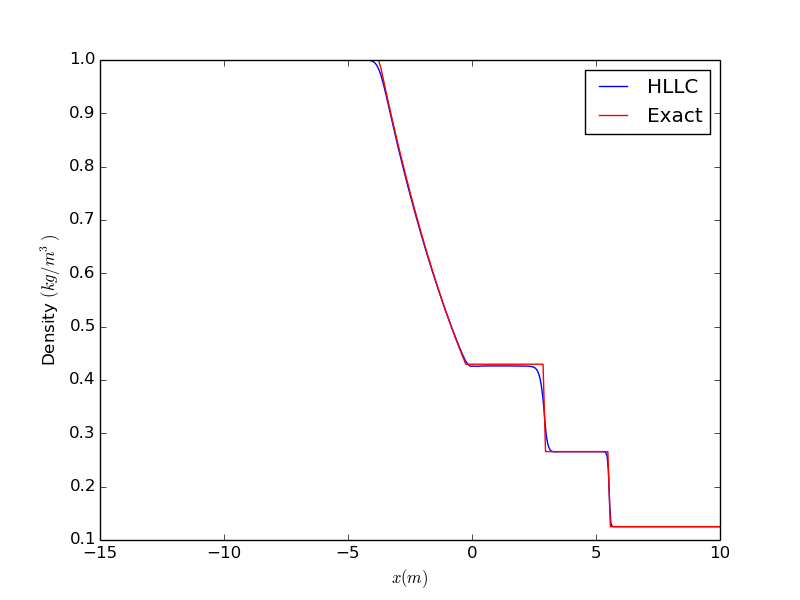
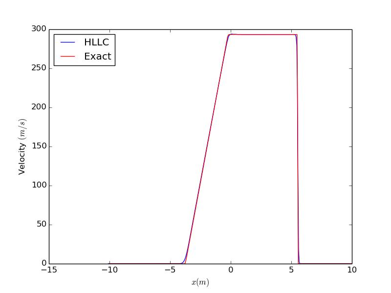

# One-dimensional HLLC Riemann solver 

This is a one-dimensional Riemann solver based on the Harten-Lax-Van Leer-Contact (HLLC) scheme 
with a minmod limiter for limiting the slopes of the primitive variables. 

# Structure of the code
The source code is in `Source`, and the test cases are in `Exec`. In each of the test cases in 
`Exec` - for eg. `Exec/Sod`, there is a file `Initialize.cpp` in which the input parameters, and 
initial condition for the simulation can be specified. There is a Makefile in each of the test case 
directories.

# Compilation and running 
`cd Exec/Sod`   
`sh run_RiemannSolver.sh`

# Visualization
There is a `Results` directory in each test case directory. It contains a Python script 
`PlotSolution.py`. `python PlotSolution.py` will display a movie of the density as a 
function of time.

# Results for the test cases
## 1. Sod shock tube test case

The domain is `-10 < x < 10` with 401 cells in the domain, and a time step of `dt=1.25e-5 s`. The 
end time is `t=0.01 s`. The initial condition is   

$$
(\rho,u,p)=
\begin{cases}
(1.0, 0.0, 100000.0)~x\le0\\
(0.125, 0.0, 10000.0)~x\gt0\\
\end{cases}
$$

  

